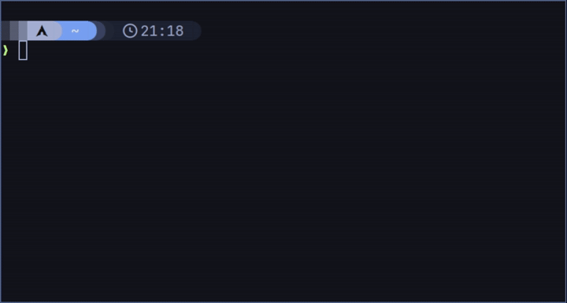

# ToGo
Simple terminal based application written in Go.

## Features
well, for now, the basics of the basics :
- add/delete a task
- mark/unmark a task
- list with the -ls flag
- add a task at the end with the -add flag

## Coming features
- More commands without opening the app (remove, etc.).
- Better help -h
- Settings menu and a config file written in TOML or YAML.
- Theme selector.
